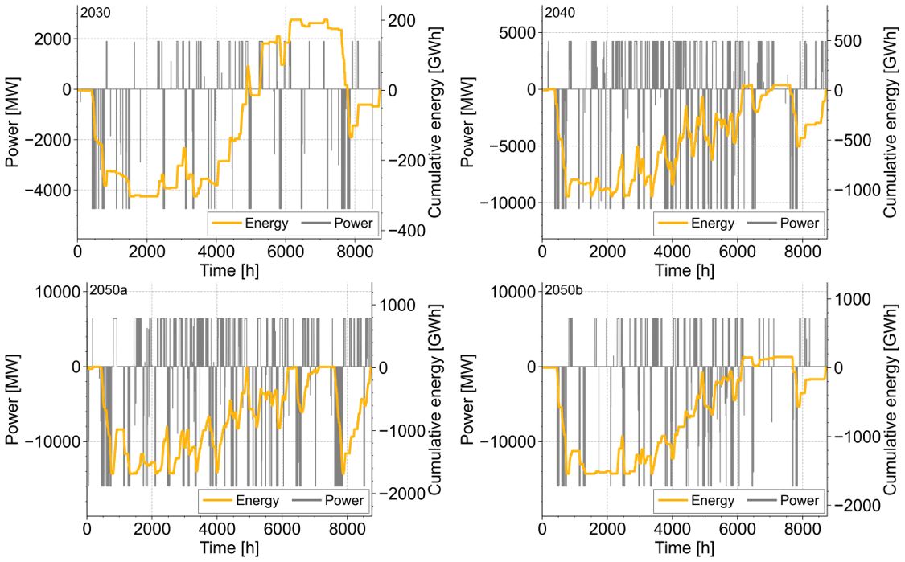
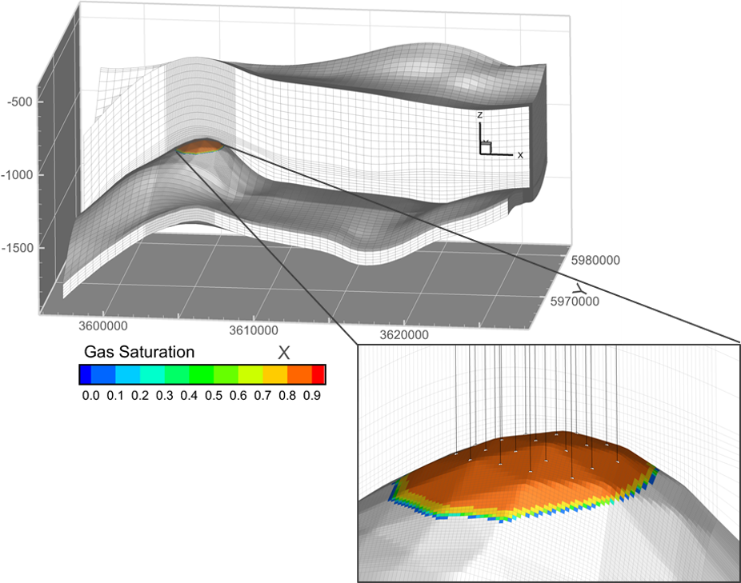
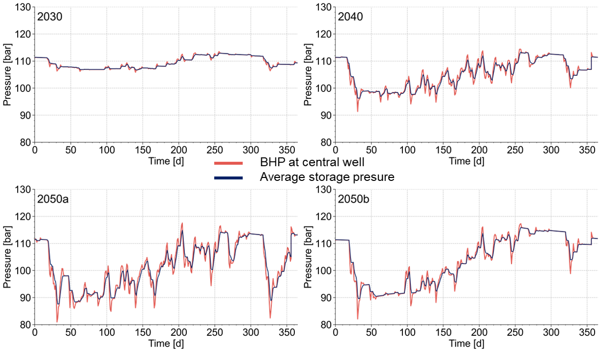
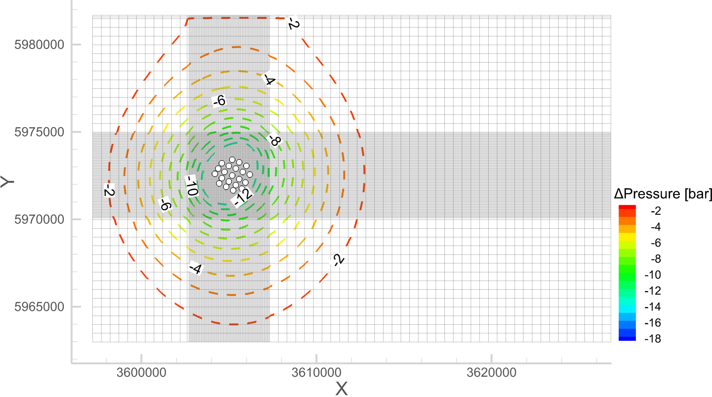

# Hydraulic Effects of Subsurface Hydrogen Storage
This repository contains the inputs, model assumptions and results related to a study on the induced hydraulic effects of hydrogen storage using an existing storage structure in the North German Basin (Schleswig-Holstein). The motivation behind this study is to focus on balancing the fluctuating availability of renewables in the national (Germany) energy system.

Four future energy system scenarios are analysed here; these scenarios are based on different energy system development pathways, with main attributes such as shares and types of renewables. For the hydraulic impact assessment, this study applies hourly and daily resolution energy-balanced load profiles. Numerical simulation is performed using a commercial reservoir simulator. The following sections introduce the assumptions and results.

# Energy System Scenarios 
Energy system scenarios are developed within the ANGUS project, and detailed documents are available here: [ANGUS project](https://zenodo.org/record/3714708). Four scenarios are associated with future energy development pathways in Germany and neighboring countries, incorporating features such as weather data, emission costs, and the type and share of installed renewables. Expected H2 conversion losses are taken into account in the load profile. The energy density of H2 is based on its lower heating value of 2.95 kWh/sm³. Overall, depending on the respective energy system scenario, the storage facility should maintain hydrogen charging rates during times of surplus power, varying from 1.9 GW to 6.4 GW, and discharging rates during withdrawal, ranging from 4.7 GW to 15.9 GW.

|Code |Scenario|Renewable share [%]|CO2 emission price [EUR/t]|Storage demand [TWh]|
|-----|--------|-------------------|--------------------------|--------------------|
|2030 |2030NEPC|86                 |29.4                      |1.1                 |
|2040 |2040GCA |90                 |126                       |6.1                 |
|2050a|2050NB  |100                |150                       |10.7                |
|2050b|2050REF |100                |150                       |5.5                 |

<picture>
  <source media="(prefers-color-scheme: dark)" srcset="figures/energy_system_load_profiles.png" style="background-color:#808080">
  <source media="(prefers-color-scheme: light)" srcset="figures/energy_system_load_profiles.png">
  
</picture>

# Geological storage model

The storage model is built on the existing Eckhorst anticline structure in the Eastholstein block, within the Rhaetian (Upper Keuper) porous formation at a depth of about 1 km. Formation permeability and porosity are derived from regional depth correlations, while boundary conditions are applied considering the local geological settings. The reservoir model assumes immiscible two-phase flow of water and gas, with fluid properties derived from the CoolProp library and modelled as black oil model type. Brooks-Corey formulations are employed for phase permeabilities and capillary pressure modelling. The extended model boundary is represented using the large pore volume technique with an initial gas in place volume (GIP) of 2.8×109 sm3.

<picture>
  <source media="(prefers-color-scheme: dark)" srcset="figures/eckhorst_storage_model_GWC.png" style="background-color:#808080">
  <source media="(prefers-color-scheme: light)" srcset="figures/eckhorst_storage_model_GWC.png">
  
</picture>

The storage build-up phase is not considered in the simulation; instead, the initial condition is established by setting the gas–water contact. This configuration sets the starting conditions for the cyclic  storage simulations and serves as the basis for analysing the induced hydraulic effects. To reach equilibrium, a spin-up simulation with uniform injection and withdrawal patterns is used. 21 vertical wells are placed at the top of the anticline structure, with equal spacing between them, to maintain consistent rates for all scenarios and ensure a unique comparison.

# Results
The porous media storage facility fully supports the required power rates for the energy system through 21 vertical storage wells. The utilisation of the storage facility heavily depends on the energy system development pathways, with the working gas volume ranging between 4% and 21% of the initial hydrogen GIP volume in storage.

Frequent utilisation of the storage facility is observed in scenario 2050a, characterised by a high share of renewables (up to 100%) and the absence of biomass installations in Germany. A high CO2 emission price (>126 EUR/t), combined with a high share of renewable energy sources (>90%) and the exclusion of biomass, significantly increases the demand for hydrogen storage on a TWh scale.

<picture>
  <source media="(prefers-color-scheme: dark)" srcset="figures/rst_Pressure_WBHP.png" style="background-color:#808080">
  <source media="(prefers-color-scheme: light)" srcset="figures/rst_Pressure_WBHP.png">
  
</picture>

Scenario analysis indicates that significant pressure responses are induced at the well bottom hole, constrained within a geomechanically allowable range of 80 to 130 bars. Due to the high withdrawal rates required, the storage design is primarily influenced by the lower pressure limit. In the far field, pressure responses exceeding 3 bars and 5 bars are detected within horizontal distances of up to 7.5 km and 5 km, respectively. The vertical pressure impact is much lower, at 5 m and 20 m, respectively. This translates to an impacted volume of 1.25×109 m3 to 4.63×10⁹ m3 at 3 bars, and 0.57×109 m3 to 1.10×109 m3 at 5 bars, depending on the scenario.

This study demonstrates that grid-scale energy storage will require subsurface space on the order of tens of millions of cubic meters for the hydrogen gas phase. However, a much larger volume of up to 4.6×10⁹ m³ will be affected by pressure changes of 3 bars or more. From an energetic perspective, the investigated storage structure is sufficient to accommodate the national storage demand.

| Scenario | Storage well no. | Operational bulk volume [m3] | Affected volume by 3 bar [m3] | Affected volume by 5 bar [m3] |
| -------- | ---------------- | ---------------------------- | ----------------------------- | ----------------------------- |
| 2030 | 21               | 0.35E+08                     | 46.25E+08                     | 9.62E+08                      |
| 2040  | 21               | 0.35E+08                     | 16.74E+08                     | 5.71E+08                      |
| 2050a   | 21               | 0.35E+08                     | 12.45E+08                     | 5.78E+08                      |
| 2050b  | 21               | 0.35E+08                     | 25.33E+08                     | 10.98E+08                     |

## License
This repository is licensed under the [MIT license](https://github.com/git/git-scm.com/blob/main/MIT-LICENSE.txt). You are free to use, copy, modify, however, the license comes with no warranty or liability and you must include a copy of the license.

### Reference
- Gasanzade, F. and Bauer, S.: Hydraulic effects of porous media hydrogen storage for different future energy supply systems, EGU General Assembly 2022, Vienna, Austria, EGU22-5778, doi.org/10.5194/egusphere-egu22-5778
- National scale energy system scenarios, doi:10.5281/zenodo.3714708